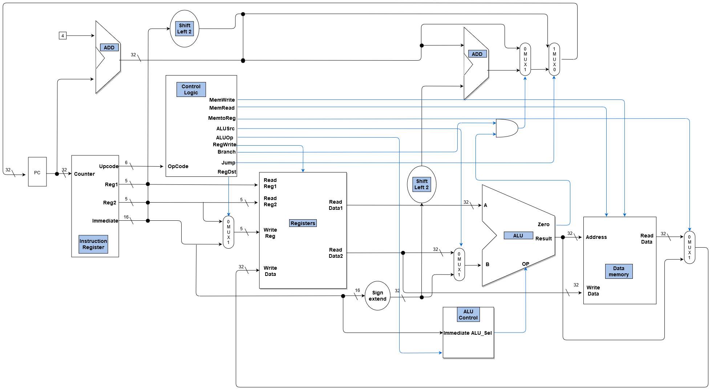
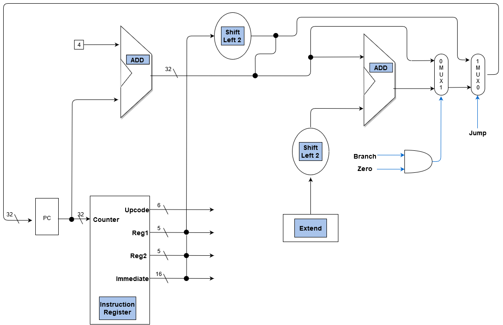
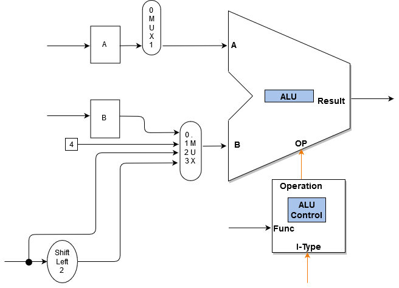
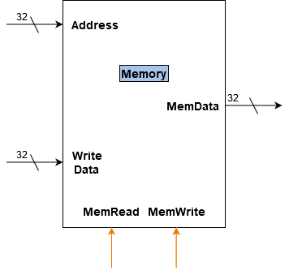
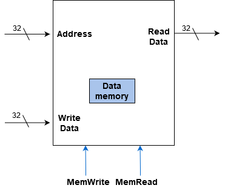

# MIPS
## Introduction

Because  memory  was  expensive  in  old  days,  designer  of  instruction  enhanced  complication  of  instruction  to  reduce  program   length.   Tendency   of   complication   instruction   design  brought  up  one  traditional  instruction  design  style,  which is named “Complex Instruction Set Computer-CISC” structure.  But  great  disparity  among  instructions  and  low  universal  property  result  in  instruction  realization  difficulty  and long running-time cost. Comparing to CISC, RISC CPU have  more  advantages,  such  as  faster  speed,  simplified  structure easier implementation. RISC CPU is extensive use in embedded system. Developing CPU with RISC structure is necessary choice.

MIPS is a RISC microprocessor architecture.  The MIPS Architecture defines 32-bit general purpose registers (GPRs). The CPU uses byte addressing for word accesses and must be aligned on a byte boundary divisible by four.  MIPS only has three instruction types: I-type is used for the Load and Stores instructions, R-type is used for Arithmetic instructions, and J-type is used for the Jump instructions. MIPS is a load/store architecture, meaning that all operations are performed on operands held in the processor registers and the main memory can only be accessed through the load and store instructions (e.g lw, sw).  A load instruction loads a value from memory into a register.  A store instruction stores a value from a register to memory.  The load and store instructions use the sum of the offset value in the address/immediate field and the base register in the $rs field to address the memory.  Arithmetic instructions or R-type include: ALU Immediate (e.g. addi), three-operand (e.g. add, and, slt), and shift instructions (e.g. sll, srl).  The J-type instructions are used for jump instructions (e.g. j).  Branch instructions (e.g. beq, bne) are I-type instructions which use the addition of an offset value from the current address in the address/immediate field along with the program counter (PC) to compute the branch target address; this is considered PC-relative addressing.

## MIPS Instruction Format
MIPS is a RISC processor, so every instruction has the same length — 32 bits (4 bytes). These bits have different meanings according to their displacement. They can be combined in following groups:

| Name                     | Size | Symbol | Used for                                              |
|--------------------------|------|--------|-------------------------------------------------------|
| Opcode                   | 6    | E      | Specification of instruction                          |
| Register specifications  | 5    | s,t,d  | Source, target and  destination registers             |
| Register- immediate      | 5    | R      | Second part of opcode for RI instructions             |
| Shamt                    | 5    | S      | Constant value for shifts                             |
| Inmediate constant value | 16   | C      | Inmediate value for arithmetic and logical operations |
| Address                  | 26   | A      | Address for jumps and procedure calls                 |
| Funct                    | 6    | f      | Second part of opcode for  instructions               |

Looking  at  the  MIPS  processor core instruction table above it  can be seen that there are assigned different formats for certain  instructions. This is because different instructions use different operands and hence different formats needed to be constructed  for  them.

### R-type Format
The most common style of instruction is the R-type. The R-type instruction has two read registers and one write register.  
| 31-26  | 25-21 | 20-16 | 15-11 | 10-6  | 5-0    |
|--------|-------|-------|-------|-------|--------|
| 000000 | sssss | ttttt | ddddd | SSSSS | ffffff |

All of the instructions have a 6-bit opcode, which is used to determine what type of instruction is to be executed. Each of the  register  specifications  in  all  of  the  instructions  is  5-bits  wide.  The  first  two  5-bit  register  specifications  are  the  two  read  registers  and  the  last  5-bit  register  specification  is  the  destination  register,      that  the  instruction  will  use.  The  last  6-bits  in  the  instruction  are  used  as  function  bits.  This  function bits specify what the actual instruction that will be performed.

### Inmediate Format
| 31-26  | 25-21 | 20-16 |       15-0       |
|--------|-------|-------|------------------|
| EEEEEE | sssss | ttttt | CCCCCCCCCCCCCCCC |

The I-type is similar to the R-type except the second read  register  and  the  5  function  bits  are  replaced  by  a  16-bit  immediate  value.  Each  I-type  opcode  can  have  only  one  instruction because it has no function bits like the R-type.

## Pipeline Design
Pipeline decomposition enhances throughput rate of instruction.  Clock  cycle  is  decided  by  the  slowest  stage  running  time.  In  general  words,  pipeline includes five stages: instruction fetch, instruction decoder D, execution, memory, write-back.

  

### Instruction Fetch
The Instruction Fetch stage is responsible for obtaining the  requested  instruction  from  memory. The  main  components of the IF stage can be seen in the figure below. The instruction   and   the   program   counter   (which   is   incremented  to  the  next  instruction)  are  stored  in  the  IF/ID  pipeline register as temporary storage so that may be used in the next stage at the start of the next clock cycle. 

  

### Execution
EXE  stage  executes  arithmetic.  Main  component  of  EXE  stage   is   ALU.   Arithmetic   logic   unit   and   shift-register   compose  of  ALU.  Function  of  EXE  stage  is  to  do  operation  of  instruction,  such as add and subtraction. ALU sends result to EX/MEM pipeline register before entering MEM stage. 

  

### Memory
Function of MEM stage is to fetch data from memory and store data to memory. Another function is to input data to  processor  and  output  data.  If  instruction  is  not  memory  instruction or IO instruction, result is sent to WB stage. MEM stage structure shows in Figure below Storing data in register  is  main  function  after  result  is  calculated.  Some  result may be not stored in RAM definitely, and some result can  be  written  to  register  directly.  Give  an  example,  some  temporary  variable  is  not  memorized  in  RAM  because  of  low  execution  efficiency.  However,  some  data  must  be  stored in RAM. Memory data in RAM or register depending on   demands   in   MEM   stage.   There   is   a   data   copy   in   MEM/WB pipeline register.

  

### Write-Back
WB stage charges of writing result, store data and input data to register file. The purpose of WB stage is to write data to destination   register.   For   example,   ADD   R1,   R2,   R3   instruction  memories  result  in  R1  register  to  make  program  run faster. 

  

